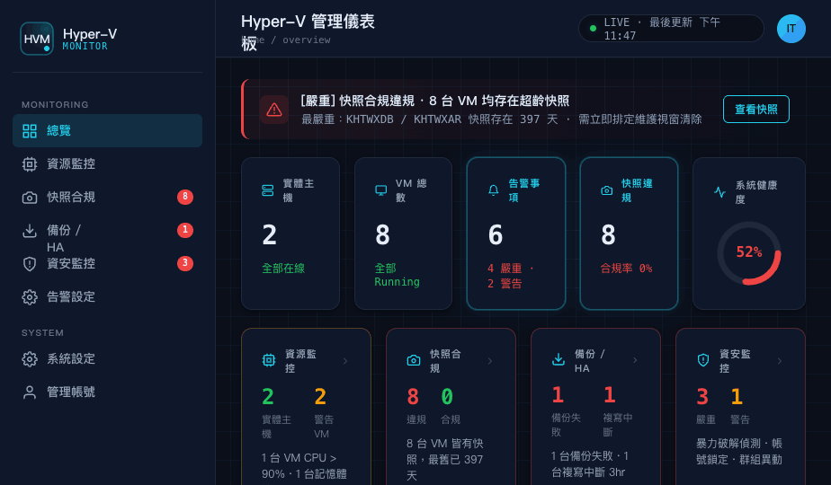
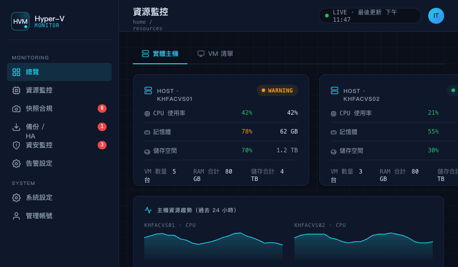
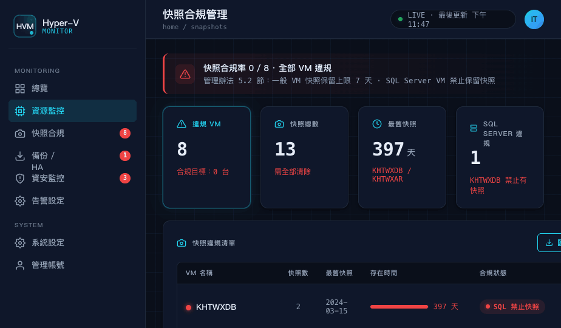
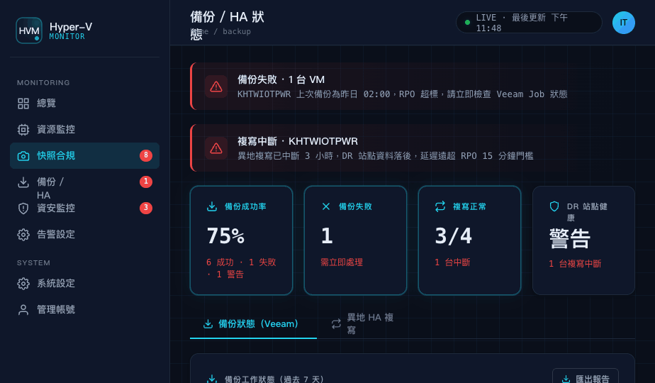

# Hyper-V Monitor（HVM）

Hyper-V 虛擬化環境統一管理儀表板，讓 IT 工程師與管理層透過單一介面掌握環境狀況，無需開啟 PowerShell 或逐一登入主機查詢。



---

## 功能概覽

| 視角 | 內容 |
|---|---|
| **總覽** | 系統健康度、告警事項、各視角燈號摘要 |
| **資源監控** | 實體主機 CPU/RAM/儲存、VM 清單與 7 天趨勢 |
| **快照合規** | 快照存在天數、違規清單、SQL Server VM 特殊規則 |
| **備份 / HA** | Veeam 備份結果、異地複寫狀態與 RPO 達標率 |
| **資安監控** | Windows Event Log 異常登入、帳號鎖定、群組異動 |
| **告警設定** | 門檻值調整、啟用/停用規則、通知收件人設定 |

截圖：

| 資源監控 | 快照合規 | 備份 / HA |
|---|---|---|
|  |  |  |

---

## 架構

```
管理 VM（2 vCPU / 4 GB RAM）
├── FastAPI 後端       ← REST API + 靜態服務前端
├── SQLite 資料庫      ← hv_metrics.db
└── Collector 排程     ← 每 5–15 分鐘採樣
        │
        │ WinRM（TCP 5985）
        ▼
Hyper-V 宿主機（KHFACVS01、KHFACVS02 ...）
└── PowerShell 遠端查詢：Get-VM / Get-Counter / Get-VMSnapshot / Event Log
```

**技術棧**

| 層 | 選型 |
|---|---|
| 前端 | React 18（CDN，無 build 步驟）、純 CSS Dark Mode |
| 後端 | Python FastAPI + SQLAlchemy ORM |
| 資料庫 | SQLite（可切換 PostgreSQL，改一行 `.env`） |
| 資料收集 | pywinrm + APScheduler |

---

## 快速開始

### 1. 環境需求

- Python 3.10+
- 管理端可透過 TCP 5985 到達各 Hyper-V 宿主機
- 宿主機已啟用 WinRM（`winrm quickconfig`）

### 2. 安裝

```bash
git clone <repo-url>
cd hyperVmonitor/backend

pip install -r requirements.txt

cp .env.example .env
# 編輯 .env，填入以下設定：
#   WINRM_USER=administrator
#   WINRM_PASSWORD=your_password
#   HV_HOSTS=192.168.1.101,192.168.1.102
```

### 3. 啟動 API

```bash
cd backend
uvicorn main:app --host 0.0.0.0 --port 8000
```

瀏覽器開啟 `http://<管理機IP>:8000` 即可看到 Dashboard。

API 文件：`http://<管理機IP>:8000/docs`

### 4. 啟動資料收集排程

```bash
cd backend
python -m collector.scheduler
```

- VM 指標、快照、複寫狀態：每 15 分鐘採樣
- 安全事件（Event Log）：每 5 分鐘採樣

---

## 設定說明

### `backend/.env`

```env
DATABASE_URL=sqlite:///./hv_metrics.db   # 可改為 PostgreSQL DSN
WINRM_USER=administrator
WINRM_PASSWORD=
HV_HOSTS=192.168.1.101,192.168.1.102    # 逗號分隔，多台宿主機
SMTP_HOST=smtp.example.com
SMTP_PORT=587
SMTP_USER=hv-monitor@example.com
SMTP_PASSWORD=
ALERT_EMAIL_IT=it-team@example.com
ALERT_EMAIL_MANAGER=it-manager@example.com
```

### 跨域存取前端

若前端與 API 不在同一個 origin，在 `hv-dashboard/HV Dashboard.html` 的 `<head>` 加入：

```html
<script>window.HVM_API_BASE = 'http://192.168.1.200:8000';</script>
```

---

## 快照合規規則

| 狀態 | 條件 |
|---|---|
| 🔴 嚴重違規 | SQL Server VM 有任何快照，或任何 VM 快照存在 > 7 天 |
| 🟡 警告 | 快照存在 3–7 天 |
| 🟢 合規 | 無快照，或快照存在 ≤ 3 天（變更緩衝期內） |

SQL Server VM 在資料庫中以 `vm.is_sql = True` 標記，需在 VM 初次同步後手動設定。

---

## 開發狀態

| 模組 | 狀態 |
|---|---|
| 前端 6 頁面 | ✅ 完成 |
| `GET /api/alerts`（告警規則設定） | ✅ 真實 DB |
| 其餘 5 個 API endpoint | ⏳ 回傳 mock data，待 collector 測試後接 DB |
| WinRM collector 各模組 | ⏳ 骨架完成，待宿主機連線測試 |
| 告警 Email 通知引擎 | ❌ 待實作 |
| Veeam 備份 collector | ❌ 待採購確認後實作 |

WinRM 連線測試步驟：[docs/winrm-test-guide.md](docs/winrm-test-guide.md)

---

## 目錄結構

```
hyperVmonitor/
├── backend/
│   ├── main.py                  # FastAPI 進入點
│   ├── database.py              # SQLAlchemy + SQLite
│   ├── models.py                # ORM 資料表定義
│   ├── schemas.py               # Pydantic response schemas
│   ├── routers/                 # API endpoints（各視角一個檔案）
│   ├── collector/               # WinRM 採樣模組 + APScheduler 排程
│   └── .env.example
├── hv-dashboard/                # 前端（無 build 步驟）
│   ├── HV Dashboard.html        # 入口
│   ├── hv-components.jsx        # 共用元件 + useFetch hook
│   ├── hv-page-*.jsx            # 各頁面元件
│   └── screenshots/
└── docs/
    └── winrm-test-guide.md      # WinRM 連線測試指南
```
